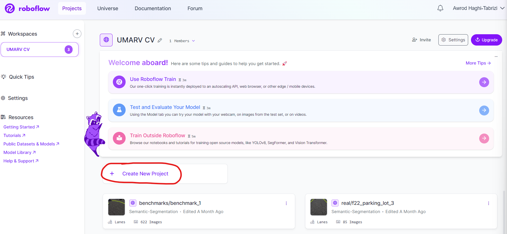
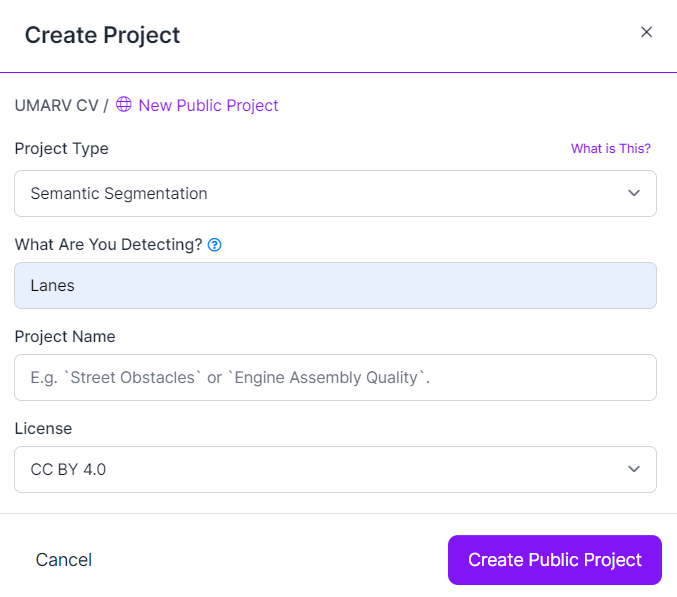

# Creating Datasets

## Real world datasets

1. Take video.
2. Convert video to .mp4 if necessary.
3. Store video in DrobBox ".../ML/raw_videos".
4. Place video in the UMARV-CV repo "/parapeters/input" directory
5. Run the script "/src/scripts/get_frames_from_video.py"
6. Take the output from "/parapeters/output"
7. Go to https://app.roboflow.com/umarv-cv
8. Click "+ Create New Project"

9. Fill in info like so, with Project name being "real_world/{name_of_dataset}"

10. Drop all the images into roboflow by selecting the folder and pointing to "{UMARV-CV repo}/parameters/output/{dataset_name}/data"
11. Once the raw frames are exported to roboflow, delete the contents of input and output in the repo.

## Unity datasets

...